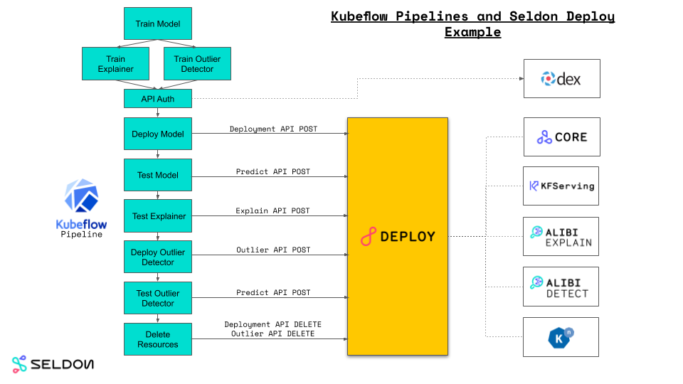
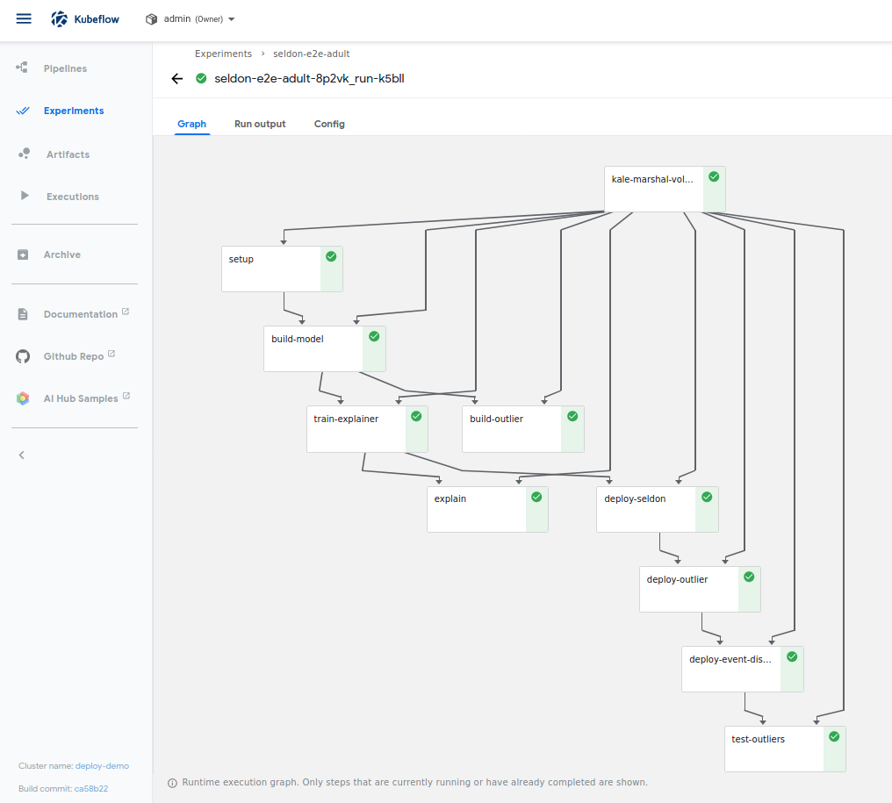

# Kubeflow Pipeline with Kale example with Seldon Deploy Enterprise API

We use [demographic features from the 1996 US census](https://archive.ics.uci.edu/ml/datasets/census+income) to build an end to end machine learning pipeline. The pipeline is also annotated so it can be run as a [Kubeflow Pipeline](https://www.kubeflow.org/docs/pipelines/overview/pipelines-overview/) using the [Kale](https://github.com/kubeflow-kale/kale) pipeline generator.

The notebook/pipeline stages are:

 1. Setup
    * Imports
    * pipeline-parameters
    * minio client test
 1. Train a simple sklearn model and push to minio
 1. Prepare an Anchors explainer for model and push to minio
 1. Test Explainer
 1. Train an isolation forest outlier detector for model and push to minio
 1. Deploy a Seldon model and test using the Seldon Deploy Enterprise API
 1. Deploy an outlier detector with the Seldon Deploy Enterprise API
 1. Test the outlier detector




## Prerequistes

 * A Seldon Deploy install. Version >=0.8.2. Installed with Kubeflow.

## GCP Setup

For a GCP cluster we need a RWX Persistent Volume for the shared data Kale needs. To set this up on GCP update and run the script `gcp-create-rwx-pv.sh` after setting the values for your project, Filestore name and Zone:

```
PROJECT=seldon-demos
FS=pipeline-data
ZONE=europe-west1-b    

gcloud beta filestore instances create ${FS}     --project=${PROJECT}     --zone=${ZONE}     --tier=STANDARD     --file-share=name="volumes",capacity=1TB     --network=name="default",reserved-ip-range="10.0.0.0/29"

FSADDR=$(gcloud beta filestore instances describe ${FS} --project=${PROJECT} --zone=${ZONE} --format="value(networks.ipAddresses[0])")

helm install nfs-cp stable/nfs-client-provisioner --set nfs.server=${FSADDR} --set nfs.path=/volumes --namespace=kubeflow 

kubectl rollout status  deploy/nfs-cp-nfs-client-provisioner -n kubeflow
```

If you build the pipeline Python DSL using Kale from the notebook you will at present need to modify the created pyhton and change the Kale `VolumeOp` by adding a `storage_class` for the NFS PV, for example:

```
marshal_vop = dsl.VolumeOp(
     name="kale-marshal-volume",
     resource_name="kale-marshal-pvc",
     storage_class="nfs-client",
     modes=dsl.VOLUME_MODE_RWM,
     size="1Gi")
```


## RBAC Setup

The default pipeline-runner service account needs to be modified to allow creation of secrets and knative triggers.

As an admin user run:


```bash
kubectl create pipeline-runner-additions.yaml
```

## Pipeline/Notebook Parameters

The pipeline/notebook has several core parameters that will need to be set correctly.

| Name | Default Value |
| ---- | ------------- |
| DEPLOY_NAMESPACE     | admin |
| DEPLOY_PASSWORD      | 12341234 |
| DEPLOY_SERVER        | https://x.x.x.x.x/seldon-deploy/ |
| DEPLOY_USER          | admin@seldon.io |
| EXPLAINER_MODEL_PATH | sklearn/income/explainer |
| INCOME_MODEL_PATH    | sklearn/income/model |
| MINIO_ACCESS_KEY     | minio |
| MINIO_HOST           | minio-service.kubeflow:9000 |
| MINIO_MODEL_BUCKET   | seldon |
| MINIO_SECRET_KEY     | minio123 |
| OUTLIER_MODEL_PATH   | sklearn/income/outlier |

## Test Notebook

Launch a kubeflow notebook with custom image:

```
seldonio/jupyter-lab-alibi-kale:0.18
```

## Test Pipeline


Assuming you have run the GCP and RBAC setup above you can launch the pipeline saved in `seldon_e2e_adult_nfs.kale.py`. 



## Tested on

If you have tested the pipeline successfully please add a PR to extend the table below.

| K8S | Kubeflow | Knative Eventing | Seldon | KFServing | Kale | Notes
| ----| -------  | ---------------- | ------ | --------- | ---- | ----- |
| GKE 1.14.10 | 1.0 | 0.11 | 1.2.3 | 0.3.0 | 0.5.0 | GCP Setup above, Kale storage_class fix, RBAC update above |


   
